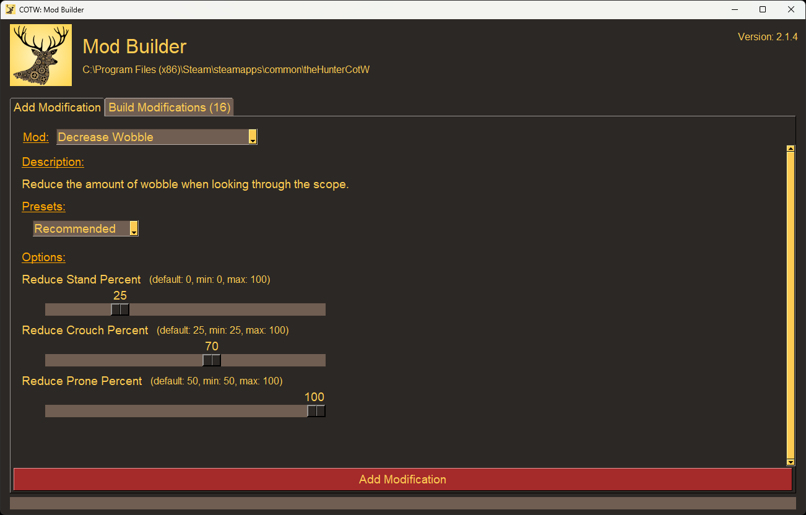

# cotw-mod-builder

A tool that makes it easy to customize and create mods for theHunter: Call of the Wild (COTW).

Release builds are available here on GitHub and on NexusMods: https://www.nexusmods.com/thehuntercallofthewild/mods/410

> Enable mods by adding the following launch options to your game executable: `--vfs-fs dropzone --vfs-archive archives_win64 --vfs-archive patch_win64 --vfs-archive dlc_win64 --vfs-fs .`



## How to Build
> Note: This was built and tested with Python 3.12.8

1. Setup virtual environment:
```
python -m venv venv
venv\Scripts\activate
```
2. Install dependencies:
```shell
pip install -r requirements.txt
```
3. Run the application:
```shell
python -m modbuilder
```
