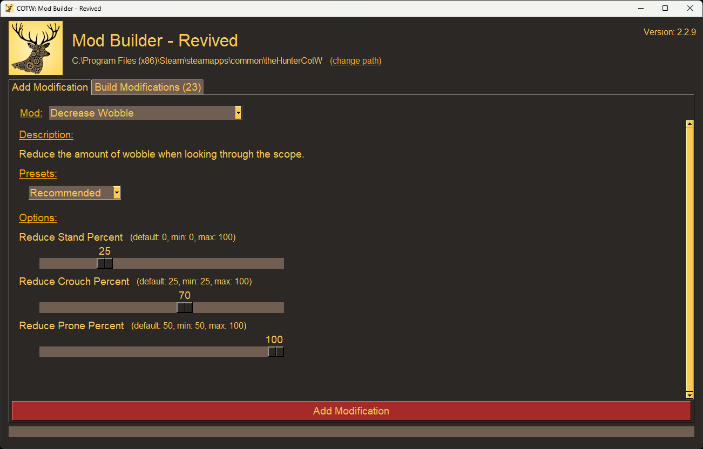

# Mod Builder - Revived

A tool that makes it easy to customize and create mods for _theHunter: Call of the Wild_ (COTW).

Enable mods by adding the following launch options to your game executable:
> `--vfs-fs dropzone --vfs-archive archives_win64 --vfs-archive patch_win64 --vfs-archive dlc_win64 --vfs-fs .`

Release builds are available in multiple locations:
* GitHub: https://github.com/RyMaxim/cotw-mod-builder/releases
* NexusMods: https://www.nexusmods.com/thehuntercallofthewild/mods/410



## Updating Mod Builder for New CotW Releases

After each game update to _theHunter: Call of the Wild_, Mod Builder needs to be updated with the latest game files. While I perform this process for each new release, the files can also be updated manually by an end-user.

> **NOTE:** Depending on the scope of changes from a game update, some mods may require code updates to continue working properly. Patching updated files into an older Mod Builder - Revived version not built for those files may result in bugs/crashes.

### Update Game Files in the `/org` Folder

1. Download the latest release of [DECA](https://github.com/kk49/deca/releases)
1. Use DECA to unpack `theHunterCotW_F.exe`
1. Look in the `/modbuilder/org` folder to determine which files to extract with DECA
1. Use the "Extract Raw Files" option to extract each new file. In some cases (ammunition + weapon tuning files) you can extract entire folders
1. Copy the extracted folders (not individual files) from DECA's `/work/hp/extracted` folder
1. Paste the copied folders into the `/modbuilder/org` folder. Overwrite any changed files

### Add New Item Names

Internal item names from the game files are mapped to human-readable names in `name_map.yaml`. This file can be found in the `_internal` folder of an already-built Mod Builder release to update an existing version. When new items are added to the game they will appear as `equipment_<type>_<name>_01` in mods like Modify Ammo, Modify Store, and Modify Weapon. Adding the appropriate data to `name_map.yaml` will allow all of the mods to display a proper name.

1. Determine the "internal" name of the item by reading the name parsed and displayed by Mod Builder from Modify Store (reads from `equipment_data.bin`)
1. Open `name_map.yaml` in a text editor
1. Find the appropriate location to add the equipment. Ammos/Sights/Weapons/Lures are organized by type. Try to keep things mostly alphabetical
1. Add the item name as a new key, removing the `equipment_<type>_` prefix. Variant suffixes (`_01`, `_02`) should be removed to group reskins of the same item (common for weapons and structures).
1. Fill in relevant data for the value (name, type, variant info)

Modify Weapon pulls names from `.wtunec` tuning files in `org/editor/entities/hp_weapons`. These names often do not match the names from other locations. Some weapons have multiple tuning files for different ammos (shotguns with shot/slugs, Grelck Drilling Rifle, etc). Most of these are handled as duplicate entries using YAML anchors (`&item` and `*item`), with an optional `ammo` value to differentiate mutliple tuning files. Follow the examples in the file to see how to format new additions.

## How to Build Mod Builder - Revived

> **NOTE:** This was built and tested with Python 3.12.10

1. Install `hatch`: https://hatch.pypa.io/latest/install
1. Set up the virtual environment:
   ```
   hatch env create
   ```
1. Run the application to test:
   ```
   hatch run modbuilder
   ```
1. Build and package the application. The `modbuilder_X.Y.Z.7z` file will be placed in `\dist`
   > **NOTE:** This can be run on macOS to produce a Mac-compatible build
   ```
   hatch run build
   hatch run pack
   ```

## Credits

This project would not exist without several generous developers that chose to open-source their tools and mods:
* [**cpypasta**](https://github.com/cpypasta): Developer of the original [Mod Builder](https://github.com/cpypasta/cotw-mod-builder) that this is forked from
* [**kk49**](https://github.com/kk49): This project relies heavily on the wonderful [DECA](https://github.com/kk49/deca) to extract and modify game files
